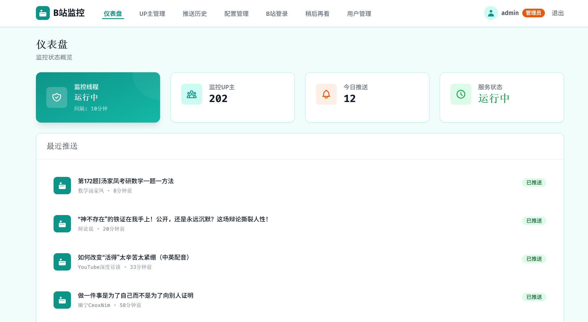

# B站UP主视频监控服务

自动监控B站关注的UP主新视频发布，通过飞书推送通知，提供Web管理后台。支持多用户、稍后再看定时推送、用户引导流程。

## 功能特性

### 核心功能

- 扫码登录B站账号
- 自动同步关注列表
- 定时检查新视频（默认10分钟）
- 飞书群机器人推送通知（交互式卡片）
- 稍后再看列表定时推送
- 多用户注册/登录系统
- 新用户3步引导流程

### Web管理后台

- **仪表盘**：监控状态概览、最近推送记录、引导进度卡片
- **用户引导**：新用户3步向导（B站登录 → 飞书配置 → UP主选择）
- **UP主管理**：查看、添加、移除监控UP主，同步关注列表
- **推送历史**：历史推送记录查询、筛选、分页
- **稍后再看**：查看稍后再看列表，手动推送
- **稍后再看历史**：稍后再看推送记录查询
- **配置管理**：修改检查间隔、飞书Webhook、推送时间等
- **登录管理**：B站扫码登录、登录状态查看
- **用户管理**（管理员）：用户增删、权限管理

## 技术栈

| 层级   | 技术                                           |
| ------ | ---------------------------------------------- |
| 后端   | Python 3.10+ / FastAPI                         |
| 前端   | Jinja2模板 / Tailwind CSS CDN / 原生JavaScript |
| 数据库 | SQLite (WAL模式)                               |
| 推送   | 飞书群机器人 Webhook                           |

## 实现效果



## 快速开始

### 1. 安装依赖

```bash
pip install -r requirements.txt
```

### 2. 启动服务

```bash
# 启动Web服务（默认端口3231）
python main.py --web

# 自定义端口和监听地址
python main.py --web --port 8080 --host 127.0.0.1

# 访问 http://localhost:3231
# 首次使用需注册账号
```

### 3. 配置飞书Webhook

1. 在飞书群中添加群机器人
2. 获取Webhook地址
3. 注册账号后进入引导流程，或前往"配置管理"页面填入Webhook地址
4. 点击"测试推送"验证配置

## Web管理后台使用指南

### 注册与登录

- 访问 `http://localhost:3231`
- 首次使用点击"注册"创建账号
- 注册后自动进入3步引导流程

### 用户引导流程

新用户注册后自动进入引导向导，3步完成初始配置：

1. **B站登录** — 扫描二维码绑定B站账号
2. **飞书配置** — 输入飞书Webhook地址并测试推送
3. **UP主选择** — 从关注列表选择要监控的UP主

每步可单独完成或跳过，仪表盘会显示引导进度直到全部完成。

### 仪表盘

- 查看监控UP主数量、今日推送数量
- 查看监控调度器运行状态（运行中/下次检查时间）
- 手动触发即时刷新
- 未完成引导时显示进度提示卡片

### UP主管理

- 查看所有监控中的UP主
- 搜索UP主（按名称或ID）
- 同步B站关注列表
- 添加新的UP主到监控列表
- 移除不需要的UP主

### 推送历史

- 查看历史推送记录
- 按UP主筛选
- 按日期范围筛选
- 分页浏览

### 稍后再看

- 查看B站稍后再看列表
- 管理员可查看所有用户的稍后再看列表
- 手动推送稍后再看视频
- 配置每日定时推送时间

### 稍后再看历史

- 查看稍后再看推送记录
- 按用户筛选（管理员）
- 分页浏览

### 配置管理

- 修改检查间隔（最小5分钟）
- 修改最大监控UP主数量
- 配置飞书Webhook地址
- 配置稍后再看每日推送时间
- 测试推送功能
- 配置热更新（无需重启服务）

### B站登录管理

- 查看当前登录状态
- 查看Cookie过期时间
- 扫码重新登录

### 用户管理（管理员专属）

- 查看所有注册用户
- 删除用户（级联删除关联数据）

## 项目结构

```
monitor_onlineVideo/
├── config/                  # 配置文件
│   └── settings.yaml        # 系统配置
├── data/                    # 数据文件
│   └── monitor.db           # SQLite数据库
├── src/                     # Python源码模块
│   ├── bilibili.py          # B站API封装
│   ├── feishu.py            # 飞书推送
│   ├── scheduler.py         # 定时调度
│   ├── sync_service.py      # 关注列表同步服务
│   ├── login.py             # 扫码登录
│   ├── database.py          # 数据库管理
│   ├── models.py            # 数据模型
│   ├── exceptions.py        # 异常定义
│   ├── web.py               # FastAPI应用主文件
│   └── api/                 # API路由
│       ├── ups.py           # UP主管理API
│       ├── videos.py        # 视频/推送历史API
│       ├── config.py        # 配置管理API
│       ├── login.py         # B站登录管理API
│       ├── toview.py        # 稍后再看API
│       └── onboarding.py    # 用户引导API
├── templates/               # Jinja2模板
│   ├── base.html            # 基础布局
│   ├── login.html           # 登录页面
│   ├── register.html        # 注册页面
│   ├── dashboard.html       # 仪表盘
│   ├── onboarding.html      # 用户引导向导
│   ├── ups.html             # UP主管理
│   ├── videos.html          # 推送历史
│   ├── toview.html          # 稍后再看
│   ├── toview_history.html  # 稍后再看推送历史
│   ├── admin_toview.html    # 管理员稍后再看
│   ├── config.html          # 配置管理
│   ├── bilibili_login.html  # B站登录管理
│   └── users.html           # 用户管理（管理员）
├── static/                  # 静态文件
│   ├── js/
│   │   ├── main.js          # 前端交互脚本
│   │   └── onboarding.js    # 引导流程交互脚本
│   └── css/
├── scripts/                 # 工具脚本
│   ├── migrate_json_to_sqlite.py     # JSON数据迁移
│   ├── migrate_to_multi_user.py      # 多用户数据库迁移
│   ├── migrate_add_toview_tables.py  # 稍后再看表迁移
│   ├── update_up_faces.py            # UP主头像更新
│   ├── update_video_stats.py         # 视频统计更新
│   └── clear_all_data.py             # 清空数据
├── tests/                   # 单元测试
│   ├── test_feishu.py
│   ├── test_scheduler.py
│   ├── test_onboarding_api.py
│   ├── test_onboarding_db.py
│   ├── test_toview_api.py
│   └── test_toview_functionality.py
├── deploy/                  # 部署相关
│   ├── deploy.sh            # 一键部署脚本
│   ├── DEPLOY.md            # 部署指南
│   └── bilibili-monitor.service  # systemd服务配置
├── logs/                    # 运行日志
├── main.py                  # 主入口
├── requirements.txt         # Python依赖
└── README.md
```

## API文档

启动Web服务后，访问以下地址查看API文档：

- Swagger UI: http://localhost:3231/docs
- ReDoc: http://localhost:3231/redoc

### 主要API端点

| 接口 | 方法 | 用途 |
|------|------|------|
| `/api/health` | GET | 健康检查 |
| `/api/monitor/status` | GET | 监控调度器状态 |
| `/api/monitor/refresh` | POST | 手动触发刷新 |
| `/api/ups` | GET/POST | UP主列表/添加 |
| `/api/ups/{id}` | DELETE | 移除UP主 |
| `/api/ups/sync` | POST | 同步关注列表 |
| `/api/videos` | GET | 推送历史查询 |
| `/api/config` | GET/PUT | 配置获取/修改 |
| `/api/login/qrcode` | GET | 获取登录二维码 |
| `/api/login/status` | GET | 查询登录状态 |
| `/api/toview` | GET | 获取稍后再看列表 |
| `/api/toview/push` | POST | 手动推送稍后再看 |
| `/api/toview/history` | GET | 稍后再看推送历史 |
| `/api/toview/push-time` | GET/PUT | 获取/配置推送时间 |
| `/api/onboarding/status` | GET | 获取引导进度 |
| `/api/onboarding/complete-step` | POST | 完成引导步骤 |
| `/api/onboarding/skip-step` | POST | 跳过引导步骤 |
| `/api/users` | GET | 用户列表（管理员） |
| `/api/users/{id}` | DELETE | 删除用户（管理员） |

## 部署到服务器

### 快速部署（推荐）

使用一键部署脚本：

```bash
# 克隆项目
git clone <your-repo-url>
cd monitor_onlineVideo

# 执行部署
sudo bash deploy/deploy.sh
```

### 手动部署

详细部署步骤请参考：[部署指南](deploy/DEPLOY.md)

### 部署后配置

1. **注册账号**
   - 访问 `http://<服务器IP>:3231`
   - 点击"注册"创建管理员账号

2. **B站账号登录**
   - 进入引导流程或"登录管理"页面
   - 扫码登录B站账号

3. **配置飞书推送**
   - 在飞书群添加群机器人
   - 复制Webhook地址
   - 在"配置管理"页面填入并测试

4. **同步关注列表**
   - 在"UP主管理"页面点击"同步关注"

### 服务管理

```bash
# 查看服务状态
sudo systemctl status bilibili-monitor

# 查看日志
sudo journalctl -u bilibili-monitor -f

# 重启服务
sudo systemctl restart bilibili-monitor
```
